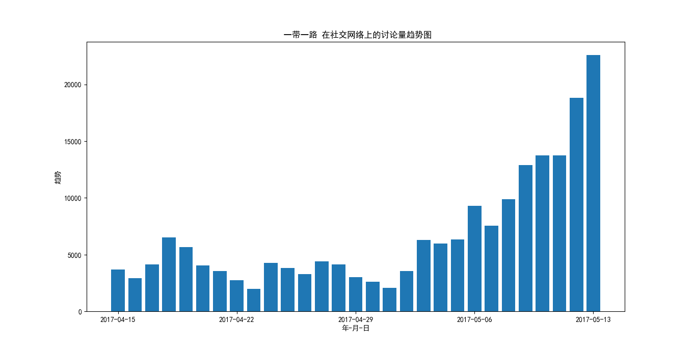

# [Pullwave](http://www.pullwave.com) 的 简单可视化 Python 实现

## 依赖
* matplotlib

## 用法
直接运行程序，会提示输入 词语，然后会绘制柱状图。会提示是否使用微博高级搜索功能（代码复用自 [Devonthink-Chinese-Seach](https://github.com/ringsaturn/DEVONthink-Chinese-Search) 项目）

目前 2017-05-15 还只能检索一个词，两个词的还需要等一阵子，并且还比较糙，细节上还有很多要改进的。

目前 2017-05-20 已有微博高级搜索功能，但是需要手动输入时间范围，并且只能抓取关键词。在考虑是否直接打开相应的网页链接。

## TODO

- [ ] 支持多词检索
- [x] 改进横坐标轴显示方式 `2017-05-15 完成`
- [x] 改进绘制图像的显示 `2017-05-15 完成`
- [ ] 增加保存图片的功能
- [ ] 争取做个比官网更强大的 GUI 程序出来
- [ ] 增加检测峰值点
- [x] 利用 Weibo 高级搜索检索尝试检索相关新闻事件。2017-05-18 完成[^1]

感谢 [Pullwave](http://www.pullwave.com) 提供的接口，让我可以直接得到感兴趣的词的趋势。

## 备注
* 为了加快程序启动速度，部分模块一直到使用时才 `import`

[^1]: 如用Pullwave检索`ios`时，在4月20日有一个峰值。在微博中高级搜索很容易得知是苹果让微信关闭文章打赏功能
